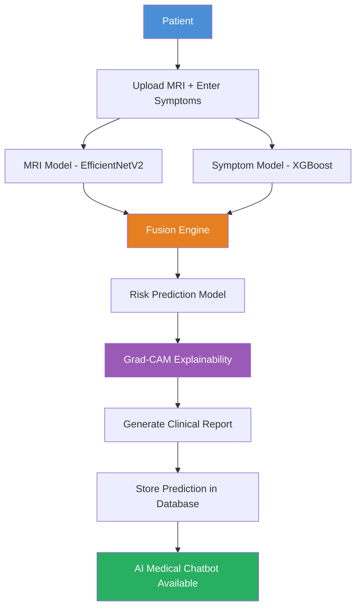
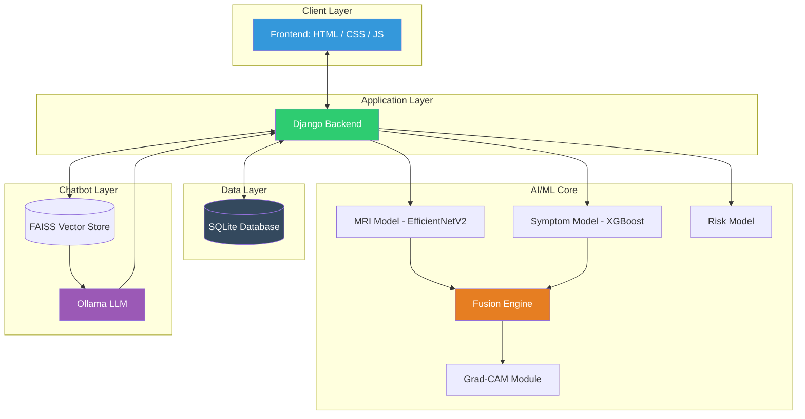

<div align="center">

# UteroCare

### AI-Powered Clinical Decision Support System for Uterine Disease Detection

**A Multimodal AI System for MRI Analysis, Clinical Symptom Modeling, Risk Assessment, and Explainable Diagnosis**

<br/>


<br/>

[Overview](#project-overview) •
[Features](#key-features) •
[Architecture](#system-architecture) •
[AI Models](#ai-models) •
[Installation](#installation-guide) •
[Screenshots](#screenshots) •
[Roadmap](#future-improvements)

</div>

---

## Disclaimer

> This project is developed for educational and research purposes. It is not a certified medical device and must not be used as a substitute for professional medical diagnosis, advice, or treatment. All predictions are intended to assist, not replace, qualified healthcare professionals.

---

## Project Overview

**UteroCare** is a multimodal, AI-powered **Clinical Decision Support System (CDSS)** built to assist healthcare professionals in the early detection and risk assessment of uterine diseases.

Traditional diagnostic tools often rely solely on medical imaging. UteroCare takes a more holistic, clinically-inspired approach by **fusing multiple independent AI models** — one that reads MRI scans, and another that reasons over patient symptoms — into a single, unified, higher-confidence diagnosis.

The system does not stop at classification. Through **Grad-CAM explainability**, it also shows *where* in the scan a prediction is grounded and helps clinicians understand *why* a decision was made, which is critical for trust and adoption of AI in real clinical workflows.

### Core Capabilities

| Capability | Description |
|---|---|
| MRI Disease Classification | Deep learning model classifies uterine MRI scans into four clinical categories |
| Symptom-Based Prediction | Gradient-boosted model predicts disease likelihood from 15+ clinical symptoms |
| AI Fusion Engine | Combines MRI and symptom predictions into one robust, multimodal diagnosis |
| Risk Stratification | Classifies patient risk as Low / Medium / High for triage prioritization |
| Explainable AI (XAI) | Grad-CAM heatmaps visually justify every MRI-based prediction |
| RAG Medical Chatbot | Retrieval-grounded chatbot answers clinical queries using verified medical documents |
| Patient Management | Full patient lifecycle: records, history, predictions, and reports |

---

## Key Features

<details>
<summary><b>User Authentication and Dashboard</b></summary>
<br/>

- Secure Login and Registration system for clinicians
- Dashboard summarizing patient statistics, recent predictions, and risk distribution
- Session-based access control to protect sensitive medical data

</details>

<details>
<summary><b>Patient Management</b></summary>
<br/>

- Add / Edit patient records with structured clinical intake forms
- Persistent medical history tracking across visits
- Automatic storage of every AI prediction tied to a patient's profile
- Searchable, filterable patient registry for quick clinical lookup

</details>

<details>
<summary><b>MRI Disease Detection</b></summary>
<br/>

Doctors upload a patient's uterine MRI scan, and the AI model returns an instant, confidence-scored classification.

**Supported Disease Classes:**

| Class | Description |
|---|---|
| Normal Uterus | No pathological findings detected |
| Fibroid | Benign smooth-muscle tumor detection |
| Adenomyosis | Endometrial tissue growth into the myometrium |
| Endometrial Cancer | Malignant tissue changes in the endometrium |

Each prediction includes a confidence score, giving clinicians a quantifiable measure of model certainty.

</details>

<details>
<summary><b>Clinical Symptom Prediction</b></summary>
<br/>

The symptom model ingests structured clinical data to independently predict disease probability, without requiring an MRI at all, making it valuable for early triage.

**Clinical Features Used:**

Age, BMI, Heavy Menstrual Bleeding, Pelvic Pain, Menstrual Cramps, Frequent Urination, Lower Back Pain, Fatigue, Pain During Intercourse, Constipation, Abdominal Swelling, Pelvic Pressure, Bleeding Between Periods, Bleeding After Menopause, Difficulty Conceiving, Diagnosed Anemia, and additional derived clinical indicators.

Powered by **XGBoost**, chosen for its strong performance on structured/tabular clinical data and built-in feature importance interpretability.

</details>

<details>
<summary><b>AI Fusion Engine — Core Innovation</b></summary>
<br/>

The **Fusion Engine** is the architectural core of UteroCare's multimodal design. Relying on a single modality (only imaging, or only symptoms) leaves diagnostic blind spots — MRI can miss early biochemical/functional signs, while symptoms alone are non-specific.

The Fusion Engine combines:

```
   MRI Model Prediction  +  Symptom Model Prediction  →  Fused Diagnosis
        (visual evidence)      (clinical evidence)
```

**Fusion Logic:**

- If MRI confidence is high and the symptom prediction agrees, fusion reinforces the diagnosis with boosted confidence
- If MRI confidence is low or ambiguous, fusion leans on the symptom model to disambiguate
- If symptom signals are weak or non-specific, fusion trusts the MRI model, which offers direct visual evidence
- If both models disagree significantly, fusion flags the case for manual clinical review rather than silently picking a side

This weighted, condition-aware fusion mirrors how a clinician cross-verifies imaging against a patient's reported history, rather than trusting a single data source blindly.

</details>

<details>
<summary><b>Disease Risk Prediction</b></summary>
<br/>

A dedicated ML classifier evaluates clinical and demographic features to estimate the overall severity/risk profile of a patient, independent of imaging.

**Output Categories:**

| Risk Level | Meaning |
|---|---|
| Low Risk | Minimal indicators; routine monitoring recommended |
| Medium Risk | Some concerning indicators; further evaluation advised |
| High Risk | Strong indicators; urgent clinical attention recommended |

This enables triage prioritization, helping clinicians decide which patients need attention first.

</details>

<details>
<summary><b>Explainable AI (Grad-CAM)</b></summary>
<br/>

Healthcare AI cannot be a black box. A model that outputs "Fibroid, 91% confidence" without justification is clinically unusable and legally risky.

**Grad-CAM (Gradient-weighted Class Activation Mapping)** generates a heatmap overlay on the original MRI, highlighting exactly which regions of the image most influenced the model's decision.

**Why this matters in healthcare AI:**

- Builds clinical trust — doctors can visually verify the AI is focusing on the correct anatomical region
- Enables error detection — if the model highlights irrelevant regions, clinicians know to disregard the prediction
- Supports regulatory and ethical compliance — explainability is increasingly required for medical AI systems
- Acts as a teaching aid for junior clinicians and radiology trainees

</details>

<details>
<summary><b>AI Medical Chatbot (RAG-Powered)</b></summary>
<br/>

A knowledge-grounded conversational assistant that answers clinical questions without hallucinating, a critical requirement in healthcare.

**Pipeline:**

1. Medical reference PDFs are chunked and embedded using Sentence Transformers
2. Embeddings are indexed in a FAISS vector database
3. On a user query, the most relevant document chunks are retrieved
4. Retrieved context and the query are passed to the LLM (Ollama) for grounded generation

This Retrieval-Augmented Generation (RAG) approach ensures every chatbot answer is traceable back to a verified medical source, rather than being generated purely from the LLM's internal (and potentially outdated or incorrect) knowledge.

</details>

---

## Tech Stack

<div align="center">

| Layer | Technologies |
|---|---|
| Frontend | HTML5, CSS3, JavaScript |
| Backend | Python, Django |
| Machine Learning | PyTorch, Torchvision, EfficientNetV2, XGBoost, Scikit-Learn, NumPy, Pandas |
| Explainable AI | Grad-CAM |
| Medical Chatbot | Ollama (LLM), FAISS, Sentence Transformers, RAG Pipeline |
| Database | SQLite |

</div>

---

## AI Pipeline



---

## System Architecture



---

## AI Models

### 1. MRI Classification Model

| Attribute | Detail |
|---|---|
| Purpose | Classify uterine MRI scans into disease categories |
| Architecture | EfficientNetV2 (transfer learning, fine-tuned) |
| Framework | PyTorch / Torchvision |
| Output | Disease class and confidence score |
| Classes | Normal, Fibroid, Adenomyosis, Endometrial Cancer |

### 2. Clinical Symptom Model

| Attribute | Detail |
|---|---|
| Algorithm | XGBoost (Gradient Boosted Decision Trees) |
| Input | 15+ structured clinical/symptom features |
| Output | Disease probability prediction |

### 3. Risk Prediction Model

| Attribute | Detail |
|---|---|
| Algorithm | Machine learning classifier (clinical feature-based) |
| Output | Risk category — Low / Medium / High |

### 4. Fusion Engine

| Attribute | Detail |
|---|---|
| Purpose | Combine MRI and symptom predictions into one robust, multimodal diagnosis |
| Method | Confidence-weighted, condition-aware decision fusion |

### 5. Grad-CAM Explainability Module

| Attribute | Detail |
|---|---|
| Purpose | Visually explain MRI-based predictions via heatmap overlays |
| Output | Highlighted region of clinical interest on the original scan |

---

## Data Flow

A step-by-step trace of a patient's journey through the UteroCare system:

1. **Patient Intake** — Clinician logs in and adds/selects a patient profile.
2. **Data Submission** — MRI scan is uploaded and clinical symptoms are entered via the intake form.
3. **MRI Inference** — The EfficientNetV2 model processes the scan and outputs a disease class with confidence score.
4. **Symptom Inference** — The XGBoost model independently processes the symptom vector and outputs its own disease probability.
5. **Fusion** — The Fusion Engine combines both predictions using confidence-weighted logic to produce a single, multimodal diagnosis.
6. **Risk Scoring** — The Risk Model evaluates clinical features to assign a Low/Medium/High risk category.
7. **Explainability** — Grad-CAM generates a heatmap over the MRI, highlighting the region driving the prediction.
8. **Report Generation** — All outputs (diagnosis, confidence, risk, heatmap) are compiled into a structured clinical report.
9. **Persistence** — The full prediction record is stored against the patient's profile in the database for longitudinal tracking.
10. **Chatbot Access** — The clinician can query the RAG-powered chatbot for additional clinical context, grounded in verified medical documents.

---

## Screenshots

> Screenshots below are placeholders — replace with actual application captures.

<div align="center">

| Login | Dashboard |
|---|---|
|  |  |

| MRI Upload | Prediction Result |
|---|---|
|  |  |

| Grad-CAM Visualization | Patient Report |
|---|---|
|  |  |

| AI Medical Chatbot |
|---|
|  |

</div>

---

## Project Structure

```
UteroCare/
├── manage.py
├── requirements.txt
├── README.md
│
├── uterocare/                     # Django project settings
│   ├── settings.py
│   ├── urls.py
│   └── wsgi.py
│
├── core/                          # Main Django app
│   ├── models.py                  # Patient & Prediction DB models
│   ├── views.py                   # Business logic & request handling
│   ├── urls.py
│   ├── forms.py
│   └── admin.py
│
├── ai_models/
│   ├── mri_model/
│   │   ├── model_weights.pth
│   │   └── inference.py           # EfficientNetV2 MRI classifier
│   ├── symptom_model/
│   │   ├── xgboost_model.pkl
│   │   └── inference.py
│   ├── risk_model/
│   │   ├── risk_model.pkl
│   │   └── inference.py
│   ├── fusion_engine/
│   │   └── fusion.py              # Fusion logic
│   └── gradcam/
│       └── gradcam_utils.py
│
├── chatbot/
│   ├── rag_pipeline.py
│   ├── faiss_index/
│   ├── embeddings/
│   └── knowledge_base/             # Source medical PDFs
│
├── static/
│   ├── css/
│   ├── js/
│   └── images/
│
├── templates/
│   ├── login.html
│   ├── dashboard.html
│   ├── patient_form.html
│   ├── mri_upload.html
│   ├── prediction_result.html
│   ├── report.html
│   └── chatbot.html
│
├── media/                          # Uploaded MRI scans & generated reports
│
└── docs/
    └── screenshots/
```

---

## Installation Guide

### Prerequisites

- Python 3.10+
- pip
- (Optional) Virtual environment tool — `venv` or `conda`
- Ollama installed locally for chatbot LLM support

### Step-by-Step Setup

```bash
# 1. Clone the repository
git clone https://github.com/<your-username>/UteroCare.git
cd UteroCare

# 2. (Recommended) Create and activate a virtual environment
python -m venv venv
source venv/bin/activate      # On Windows: venv\Scripts\activate

# 3. Install dependencies
pip install -r requirements.txt

# 4. Apply database migrations
python manage.py migrate

# 5. Run the development server
python manage.py runserver
```

Then open your browser at `http://127.0.0.1:8000/`

<details>
<summary><b>Optional: Chatbot Setup (Ollama + FAISS)</b></summary>
<br/>

```bash
# Install and start Ollama
ollama serve

# Pull your preferred model
ollama pull llama3

# Build the FAISS vector index from the knowledge base
python chatbot/build_index.py
```

</details>

---

## Future Improvements

- Cloud Deployment — containerize and deploy on AWS / Azure / GCP for scalability
- Hospital System Integration — connect with real hospital information systems (HIS)
- DICOM Support — native support for the standard medical imaging format instead of raw images
- Doctor Collaboration Tools — multi-clinician review, annotations, and second-opinion workflows
- Mobile Application — companion app for on-the-go clinical access
- FHIR Integration — standardized health data interoperability (Fast Healthcare Interoperability Resources)
- Electronic Health Records (EHR) — full EHR synchronization for longitudinal patient tracking
- Improved MRI Models — explore Vision Transformers (ViT) and ensemble architectures for higher accuracy
- LLM API Support — optional integration with hosted LLM APIs as an alternative to local Ollama inference

---

## Contributing

Contributions, issues, and feature requests are welcome. Feel free to check the [issues page](../../issues) or open a pull request.

---

## License

This project is licensed under the MIT License — see the `LICENSE` file for details.

---

<div align="center">

### A Multimodal Clinical Decision Support System — Artificial Intelligence & Machine Learning

Built to advance accessible, explainable healthcare AI.

</div>
